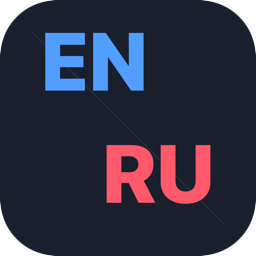

<p align="center">
  
</p>

<h1 align="center">RuEnSync</h1>

[](https://github.com/alexey1312/ruen-sync-mac/actions/workflows/ci.yml)
[](https://github.com/alexey1312/ruen-sync-mac/actions/workflows/release.yml)
[](https://www.apple.com/macos/)
[](https://swift.org)
[](LICENSE)

Native macOS menubar app that keeps a QMK keyboard's `cur_lang` in sync with the active
macOS input source. Drop-in replacement for [qmk-hid-host](https://github.com/zzeneg/qmk-hid-host),
written for the [split_keyboard_layouts](https://github.com/alexey1312/split_keyboard_layouts)
Corne firmware — but works with any QMK board that listens for `[0xAC, idx]` on its
Raw HID interface.

<!-- screenshot placeholder: drop a PNG of the menubar dropdown here once ready -->
<!--  -->

## Install

### Homebrew (recommended)

```bash
brew install --cask alexey1312/tap/ruensync
```

### Manual

Grab `RuEnSync.dmg` from the [latest release](https://github.com/alexey1312/ruen-sync-mac/releases/latest),
open it, drag the app to `~/Applications`, launch once. It registers itself as a Login
Item via `SMAppService` — no `launchctl` dance.

## Why a native rewrite

[`qmk-hid-host`](https://github.com/zzeneg/qmk-hid-host) is a great cross-platform Rust
daemon, but on macOS it has rough edges:

- Polls the input-source API every **100 ms** instead of subscribing to events.
- Needs `launchctl bootstrap` and a hand-rolled `.plist` to start at login.
- First launch of the downloaded binary trips Gatekeeper.

RuEnSync addresses all three:

- Subscribes to `kTISNotifySelectedKeyboardInputSourceChanged` — **event-driven**, no
  polling, CPU ≈ 0.
- Registers via `SMAppService` — visible in _System Settings → General → Login Items_.
- Ships signed & notarized — first run is a normal app launch, no security prompt.
- **In-app auto-updates** via [Sparkle](https://sparkle-project.org) — silent
  daily check, EdDSA-verified DMG, install on quit. No manual re-downloading.

It speaks the **same wire protocol** as `qmk-hid-host` — a 32-byte HID Output
Report of `[0xAC, idx, 0×30]` straight into the keyboard's Raw HID Interrupt
OUT endpoint (`RAW_EPSIZE`). Existing firmware needs no changes.

### Auto-pushed Mac flag

In addition to layout sync, RuEnSync sends a one-shot `_OS_TYPE` packet
(`[0xB0, 'M', 'A', 'C', 0x00, …]` — same 32-byte wire format) immediately on
every connect. Firmware
that handles this data type (see the patch in
[`split_keyboard_layouts`](https://github.com/alexey1312/split_keyboard_layouts))
can auto-flip into its macOS-Russian variant — no more "after every reflash I
have to remember to hit the Mac toggle on the keyboard before the EEPROM
remembers it".

Payload format is borrowed from
[`nomis/qmk-hid-identify`](https://github.com/nomis/qmk-hid-identify) (`MAC\0`
ASCII magic), so firmware written for that daemon works with RuEnSync too.
Firmware that doesn't know `0xB0` ignores the unknown data type — fully
backward-compatible.

## Build from source

```bash
git clone https://github.com/alexey1312/ruen-sync-mac
cd ruen-sync-mac
mise install              # installs tuist, swiftformat, swiftlint, …
mise run generate         # regenerates RuEnSync.xcworkspace
mise run build:release    # builds the universal .app

APP="$(find ~/Library/Developer/Xcode/DerivedData -name 'RuEnSync.app' -path '*/Release/*' -type d | head -1)"
cp -R "${APP}" ~/Applications/
open ~/Applications/RuEnSync.app
```

## Configuration

Lives at `~/.config/RuEnSync/config.json`. Auto-created on first launch with sensible
defaults:

```json
{
  "devices": [{ "productId": "0x0001", "name": "Corne" }],
  "layouts": ["ABC", "Russian"]
}
```

- `devices` — one or more keyboards to sync. RuEnSync opens an HID link for each;
  layout changes and the Mac flag are pushed to all of them in parallel.
- `productId` — must match your keyboard's `vial.json` / QMK USB ID.
- `layouts` — ordered list of `TISPropertyInputSourceID` suffixes. The index of the active
  layout in this array is the byte sent to the keyboard. Firmware contract: `0 → EN`,
  anything else → RU.
- `usagePage`, `usage` — optional, default to `0xFF60` / `0x61` (QMK Raw HID convention).

Using the Ilya Birman Typography Layout? Change to:

```json
{ "layouts": ["English-IlyaBirmanTypography", "Russian-IlyaBirmanTypography"] }
```

Discover your current input source's suffix:

```bash
defaults read com.apple.HIToolbox AppleSelectedInputSources
# look at "KeyboardLayout Name"
```

## Activity log

The menubar dropdown has an **Activity** sub-menu listing recent layout switches,
device connects/disconnects, and `_OS_TYPE` handshake results — useful when
debugging "why didn't my keyboard pick up the change?".

Entries persist across launches in a SQLite database at
`~/.config/RuEnSync/activity.db` (next to `config.json`). The menubar mirrors
the latest 100; the database keeps the full history so a future CLI or health
panel has a single source of truth. The DB opens in WAL mode, so any
companion process can co-read/write without blocking the menubar.

To wipe history: **Activity → Clear activity** in the menu, or
`rm ~/.config/RuEnSync/activity.db`.

## Architecture

```
┌──────────────────────────┐
│  macOS Input Source      │   ← Cmd+Space, Punto, mouse, menubar
└────────────┬─────────────┘
             │  kTISNotifySelectedKeyboardInputSourceChanged
             ▼
┌──────────────────────────┐
│  LayoutWatcher (Swift)   │   ← reads TISCopyCurrentKeyboardLayoutInputSource()
└────────────┬─────────────┘
             │
┌────────────▼─────────────┐
│  AppModel (@MainActor)   │   ← menubar state (EN / RU / —)
└────────────┬─────────────┘
             │
┌────────────▼─────────────┐
│  HIDLink (IOHIDManager)  │   ← matching dict: pid + usage + usagePage
└────────────┬─────────────┘
             │  IOHIDDeviceSetReport: 32 bytes = [0xAC, idx, 0×30]
             ▼   (no leading report-ID byte — IOKit sends buffer as-is,
             │    unlike hidapi which strips a 0x00 prefix)
┌──────────────────────────┐
│  crkbd raw_hid_receive_kb │   ← unmodified Vial-QMK firmware
└──────────────────────────┘
```

Source layout:

| File                              | Role                                                    |
| --------------------------------- | ------------------------------------------------------- |
| `RuEnSync/RuEnSyncApp.swift`      | SwiftUI `@main`, `MenuBarExtra` icon + menu             |
| `RuEnSync/AppModel.swift`         | `@Observable` state, wires Watcher and Link             |
| `RuEnSync/LayoutWatcher.swift`    | Carbon TIS + `DistributedNotificationCenter` subscriber |
| `RuEnSync/HIDLink.swift`          | `IOHIDManager` matching, open/close, `SetReport`        |
| `RuEnSync/ConfigStore.swift`      | Schema + load/seed-default                              |
| `RuEnSync/LoginItem.swift`        | `SMAppService.mainApp` register/unregister              |
| `RuEnSync/Updater.swift`          | Sparkle wrapper + SwiftUI view-model bridge             |
| `RuEnSync/ActivityStore.swift`    | Recent-events log mirror (in-memory), @Observable       |
| `RuEnSync/ActivityDatabase.swift` | SQLite persistence for the activity log                 |
| `RuEnSync/RuEnSync.entitlements`  | Empty: IOKit/Carbon work outside the sandbox            |
| `Project.swift`                   | Tuist project description                               |

## Coexistence with qmk-hid-host

`IOHIDDevice` is opened in exclusive mode by both daemons. If you start the Rust
`qmk-hid-host` LaunchAgent **and** RuEnSync at the same time, the second one to open the
device gets `kIOReturnExclusiveAccess` and stays disconnected.

RuEnSync surfaces this in the menubar as **"Device busy (qmk-hid-host running?)"**.
Once you've killed the conflicting daemon, hit **Reconnect** in the menu — no need
to restart the app.

→ **Pick one.** If you used `qmk-hid-host` before, run `cd tools/qmk-hid-host && ./uninstall.sh`
in the firmware repo first.

## Troubleshooting

Click **Open log…** in the menubar dropdown — it opens Terminal with the right
predicate already typed. Or run it manually:

```bash
log stream --predicate 'subsystem == "com.alexey1312.ruensync"' --info
```

Common issues:

- **Menubar shows `—`** — keyboard isn't connected, or `productId` in config doesn't match.
  Check `ioreg -p IOUSB | grep -i corne`.
- **Wrong punctuation in Russian** — your `layouts` array doesn't contain the actual input
  source suffix. Run the `defaults read` command above to inspect.
- **App doesn't start at login** — check _System Settings → General → Login Items_ and
  toggle the entry. SMAppService sometimes needs an explicit user confirmation.

## Development

```bash
mise run generate         # regenerate Xcode project from Project.swift
mise run build            # debug build
mise run test             # run unit tests
mise run format           # swiftformat + dprint
mise run lint             # swiftlint --strict
mise run clean            # nuke Derived + generated proj
```

Open the generated `RuEnSync.xcworkspace` in Xcode for IDE work.

## Releasing

The repo ships two GitHub Actions workflows:

- **`ci.yml`** — runs on every push/PR: `mise run format-check`, `lint`, `test`, debug
  build. Uses `macos-26` runners and Xcode 26.
- **`release.yml`** — triggers on `v*` tags. Builds Release, optionally signs +
  notarizes, packages a DMG, creates a GitHub Release, and bumps the
  [Homebrew cask](https://github.com/alexey1312/homebrew-tap/blob/main/Casks/ruensync.rb).

Tag a release:

```bash
git tag v0.2.0
git push origin v0.2.0
```

### Signing & notarization secrets (optional)

Without these, the workflow ships an ad-hoc-signed DMG (works, but Gatekeeper
prompts on first launch). With them, the DMG is fully notarized and stapled.

| Secret                     | Where to get                                                                     |
| -------------------------- | -------------------------------------------------------------------------------- |
| `BUILD_CERTIFICATE_BASE64` | `base64 -i DeveloperIDApplication.p12` (your exported Developer ID cert)         |
| `P12_PASSWORD`             | The password you set when exporting the .p12                                     |
| `KEYCHAIN_PASSWORD`        | Any random string — used to lock/unlock the temporary CI keychain                |
| `DEV_ID_APP`               | `Developer ID Application: Your Name (TEAMID)` (the exact common name)           |
| `APPLE_ID`                 | Your Apple ID email                                                              |
| `APP_PASSWORD`             | App-specific password from appleid.apple.com → Security → App-Specific Passwords |
| `TEAM_ID`                  | 10-character team identifier (in your developer account)                         |

### Homebrew cask publish (optional)

| Secret               | Purpose                                                                                                          |
| -------------------- | ---------------------------------------------------------------------------------------------------------------- |
| `HOMEBREW_TAP_TOKEN` | PAT with `repo` scope on `alexey1312/homebrew-tap`. Lets the workflow push a commit bumping `Casks/ruensync.rb`. |

If unset, the cask isn't bumped — release still works, just not auto-installable
via `brew install --cask`.

### Sparkle auto-updates (one-time setup)

The app uses [Sparkle 2](https://sparkle-project.org) for in-app updates. Each
DMG is signed with an EdDSA private key in CI; the corresponding public key is
baked into `Project.swift` and checked by Sparkle inside the running app before
applying any update.

**1. Generate a keypair (run once, locally — needs Sparkle's tools):**

```bash
# Anywhere — the tool just writes the pair to ~/Library/Application Support/Sparkle
brew install --cask sparkle
generate_keys                              # prints the public key
generate_keys -p                           # prints the same public key for paste
generate_keys -x sparkle_private_key.pem   # exports the private key to a file
```

**2. Paste the public key into `Project.swift`** — replace
`REPLACE_ME_WITH_GENERATED_PUBLIC_ED_KEY` with the value `generate_keys -p`
printed.

**3. Store the private key as a GitHub secret:**

```bash
gh secret set SPARKLE_PRIVATE_KEY < sparkle_private_key.pem
rm sparkle_private_key.pem
```

**4. Create the `gh-pages` branch** to host the appcast:

```bash
git checkout --orphan gh-pages
git rm -rf .
echo "RuEnSync appcast" > README.md
git add README.md
git commit -m "init gh-pages"
git push origin gh-pages
git checkout main
```

**5. Enable GitHub Pages** — _Settings → Pages → Source: `gh-pages` branch,
`/` root_. Wait for the first deploy; the URL will be
`https://alexey1312.github.io/ruen-sync-mac/`. The CI workflow writes
`appcast.xml` into that branch on every release.

Without these steps, the release still ships — the Sparkle steps in
`release.yml` are gated on `SPARKLE_PRIVATE_KEY` being set and silently skip
when absent. Existing installs simply won't see the new version in their
"Check for Updates…" dialog until the appcast is published.

## License

MIT — see `LICENSE`.
